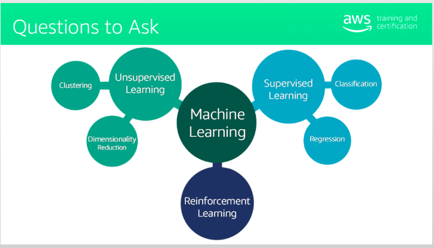

# Notes : 

## Terminologies : 

### Training : 

It is how the machine uses historical dataset to build its prediction algorithm. 

These algorithms are what make up the model. 

### Models 

The model is the core of the machine learning process. 

Its what the machine creates after it is trained and refined over time. 

### Predictions : 

A prediction is the machine's best estimate for what the output will be for a given set of inputs be. 

AKA inference of the model. 

### Division of data : 

Out of all the data available , it is divided into 2 parts : Training Dataset and Test Dataset 

Most of the data is used as the Training dataset 

Training is fed into the machine , evaluated by it and then used to create the first model. 

Then the test dataset is used for the model's accuracy . 

The accuracy of the model is determined by how close the real world predictions are made based on the test dataset. 

Training is not the whole picture of the model formation. 

## Machine learning process : 

The main goal of a machine learning model is to address a business problem. And this is possible through accurate predictions. 

In this stage , we ask the questions as , which model and learning algortihm should be used for the business problem that is at hand. 

