# Introduction : 

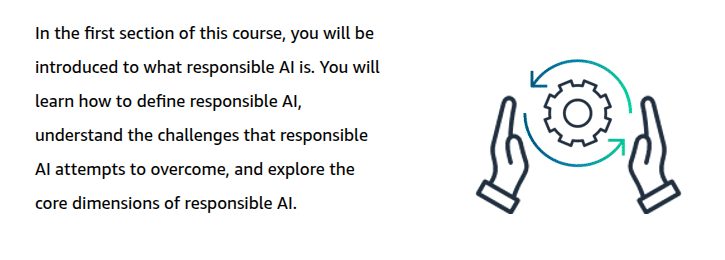

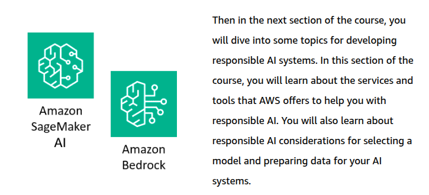

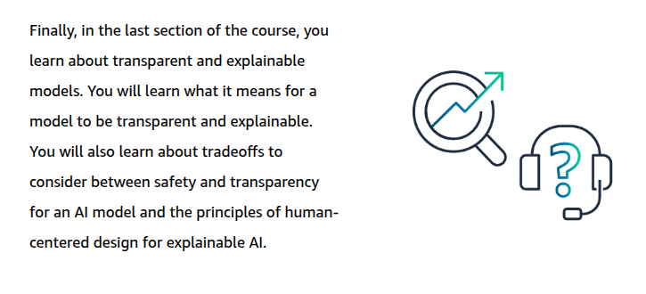

# Introduction to Responsible AI: 

## Responsible AI : 

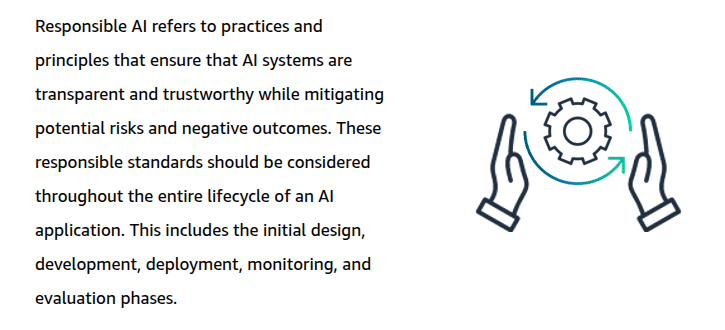

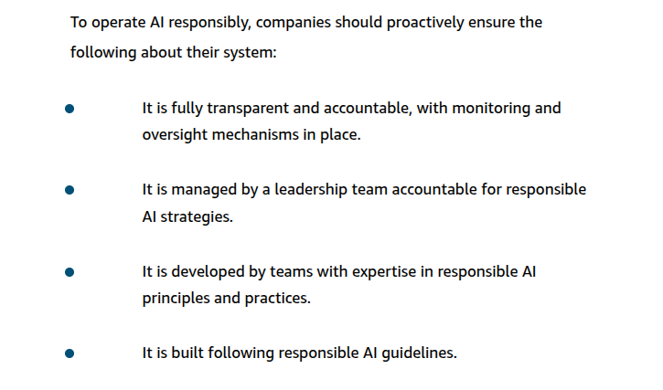

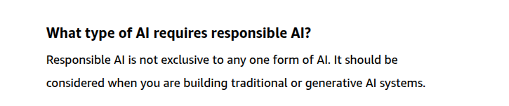

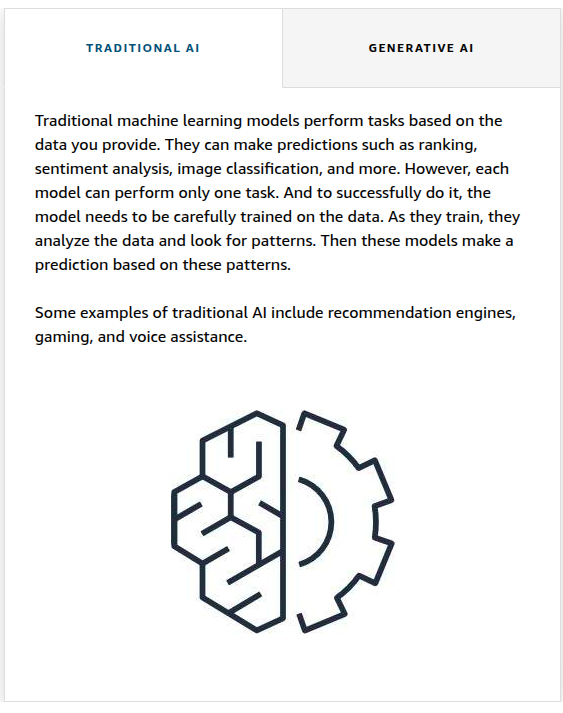

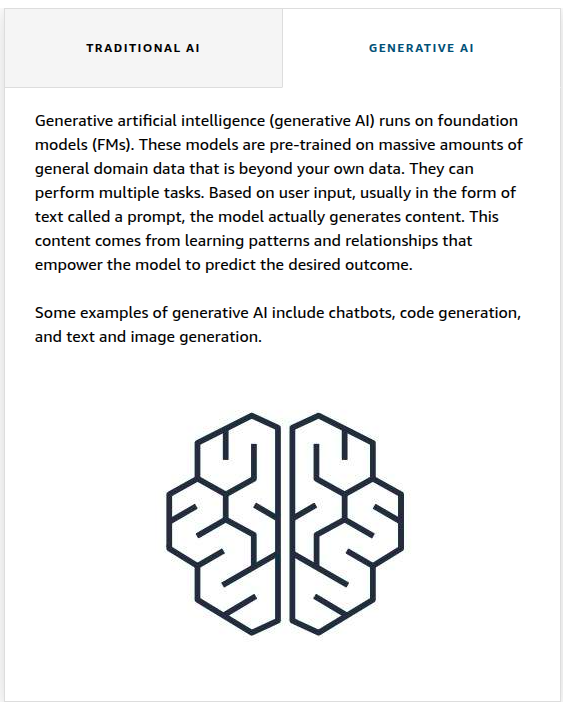

## Responsible AI Challenges in Traditional AI and Generative AI : 

### Biases in AI systems : 

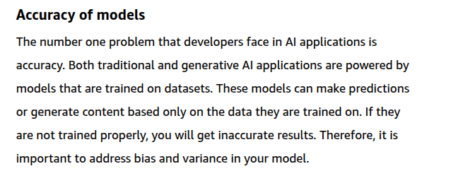

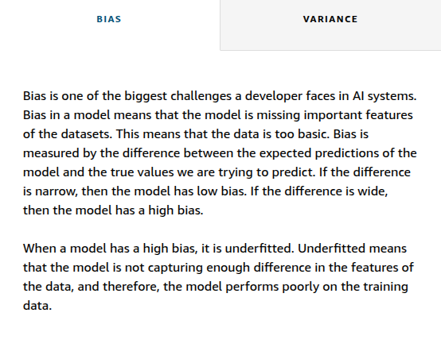

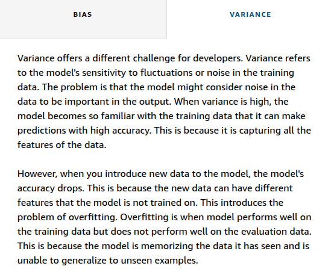

Bias : 
Biases are the assumptions that the model makes about the data. 

High bias means that the model is too simple and cannot capture the patterns in the date as expected. 

Variance : 
It is the model's sensitivity to small changes in the training data. 

High variance means that the model is too complex. The model will perform well on the training data but badly on the new unseen data . 

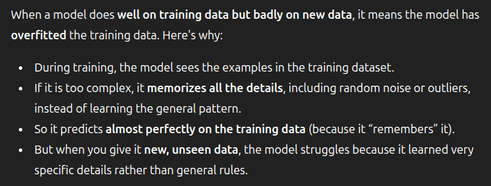

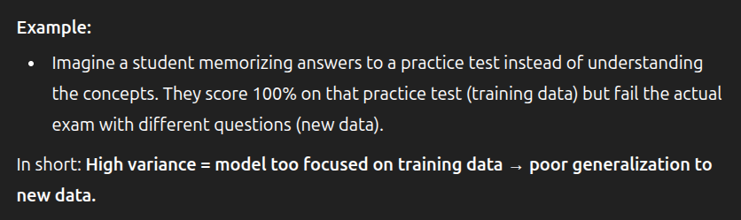

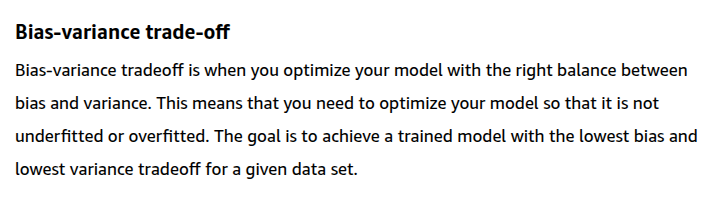

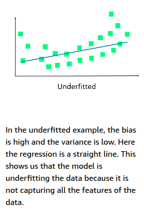

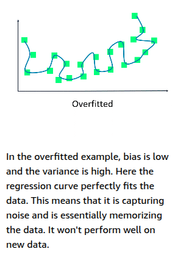

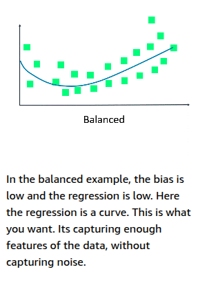

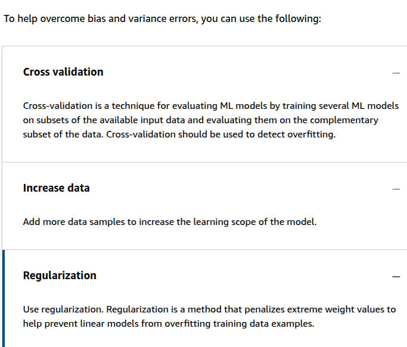

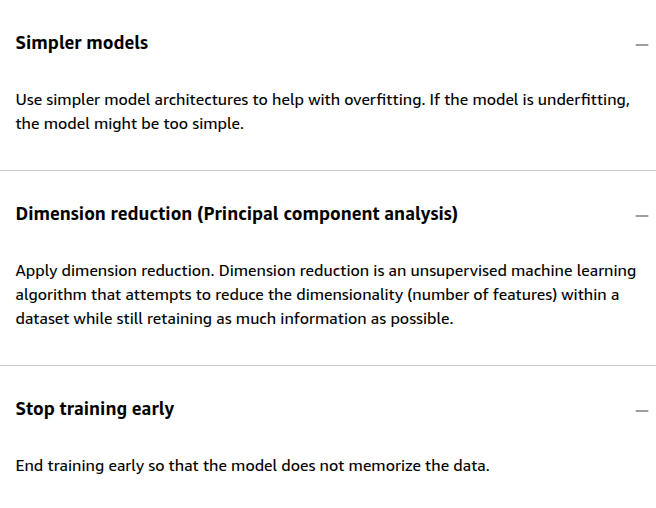

### Challenges of Generative AI : 

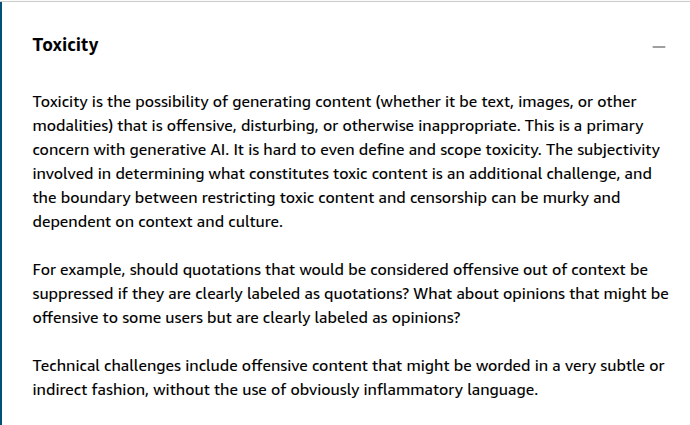

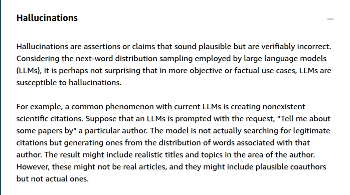

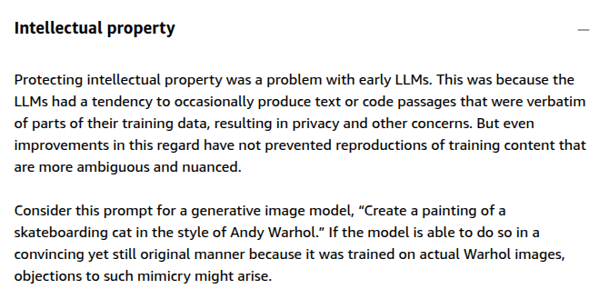

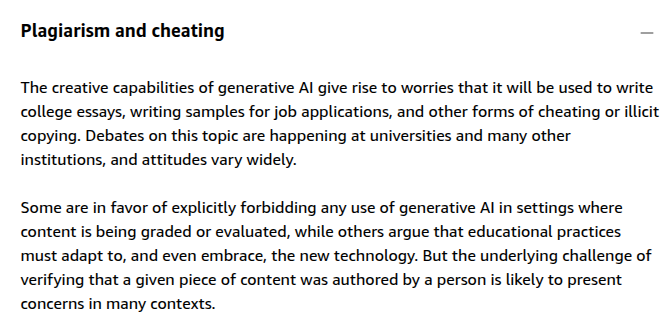

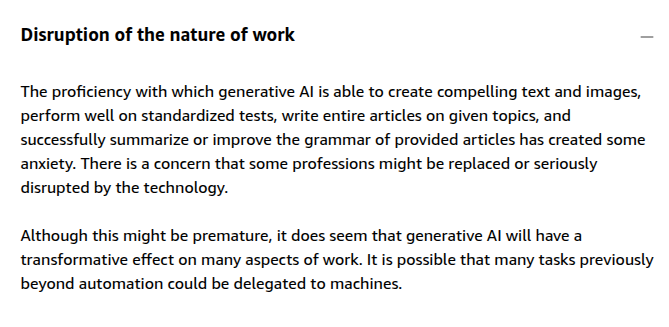

## Core dimensions of Responsible AI : 

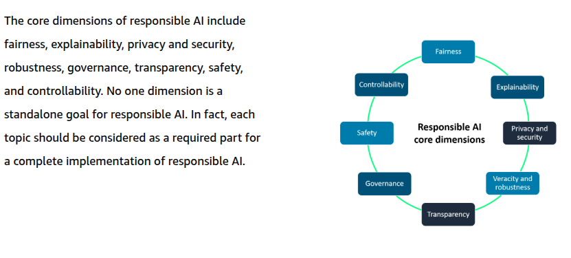

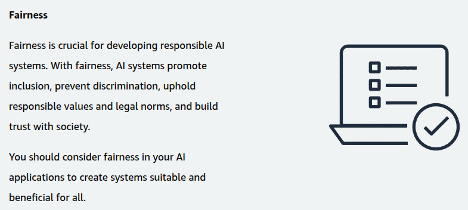

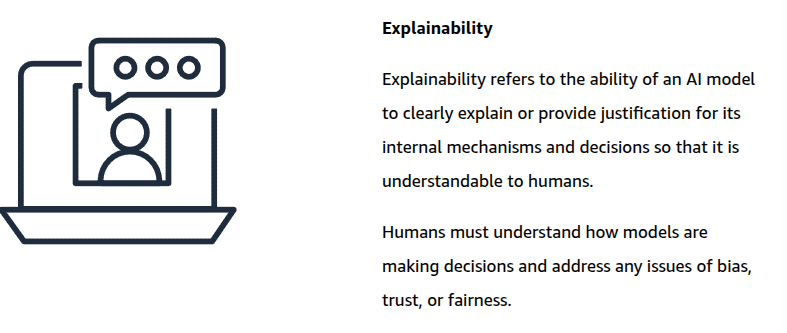

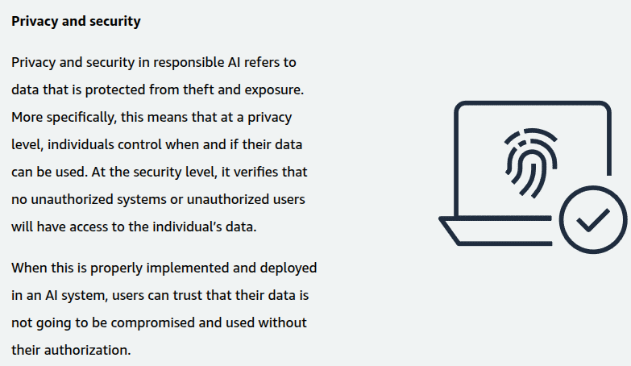

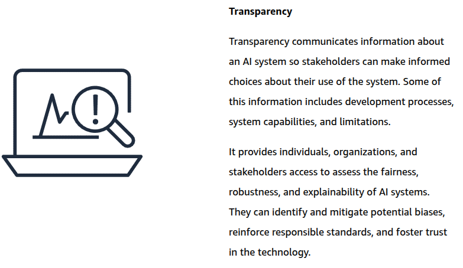

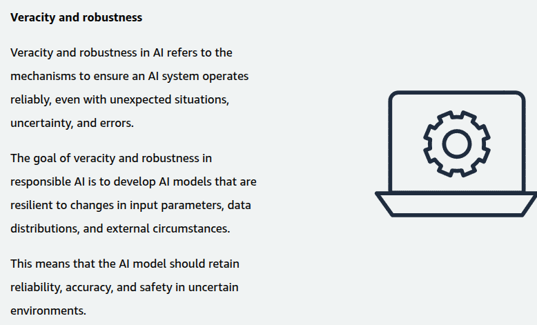

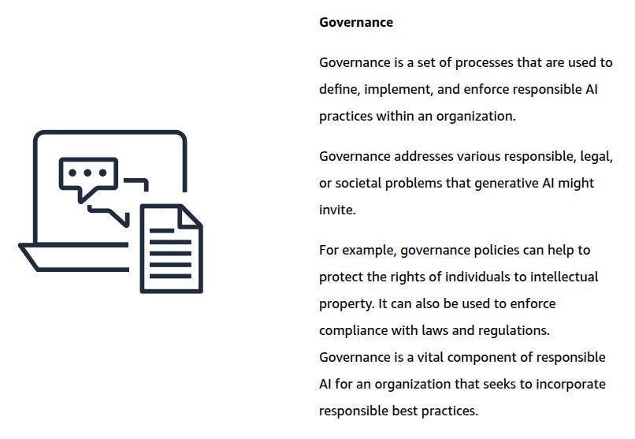

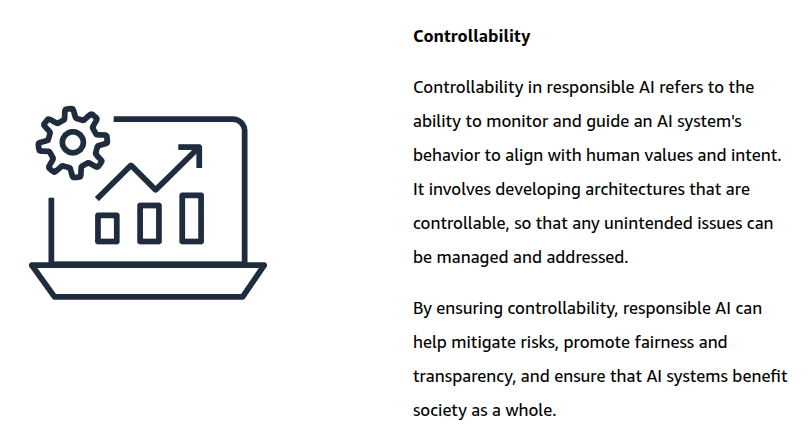

# Developing responsible AI systems : 

### Amazon Services and Tools for Responsible AI : 

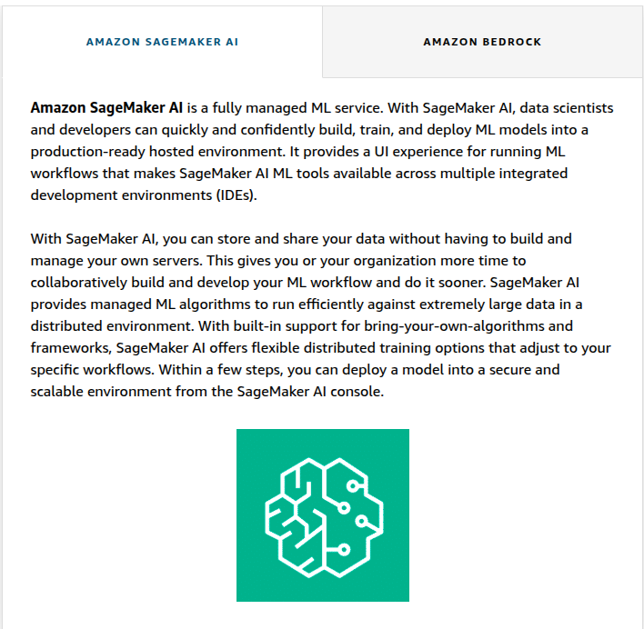

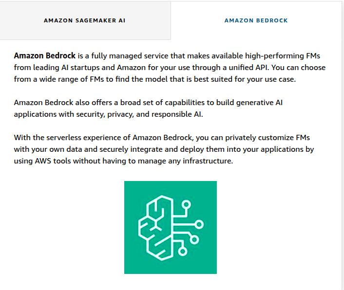

